# Authentication Mechanism Guide

## 🎯 **Overview**

This guide explains the **authentication mechanism** - how the system verifies user identity, manages sessions, and secures API access. The system implements **wallet-based authentication** using cryptographic signatures, providing a secure and decentralized approach to user authentication.

## 🏗️ **Authentication Architecture**

The system uses a **dual-token authentication mechanism** with **wallet-based authentication**:

### **Authentication Method**
- **Wallet Authentication**: Users sign messages with their private keys
- **Multi-Chain Support**: Ethereum, Polygon, BSC, and other EVM chains
- **Nonce-Based Security**: Time-limited nonces prevent replay attacks

### **Token Types**
- **Access Token**: Short-lived for API access (configurable)
- **Refresh Token**: Long-lived for token renewal (configurable)

### **Security Layers**
- **Session Management**: Tracks active sessions with device information
- **Redis Cache**: Invalidates tokens when user data changes
- **Role-Based Access**: Controls what users can access
- **Device Tracking**: Monitors login patterns for security
- **Signature Verification**: Cryptographic proof of wallet ownership

## 🔄 **How Authentication Works**

### **1. Wallet Authentication Process**

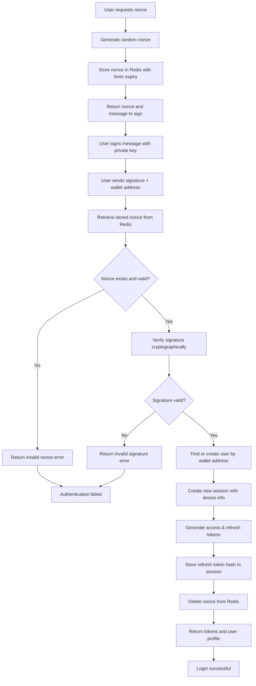

### **2. Token Validation Process**

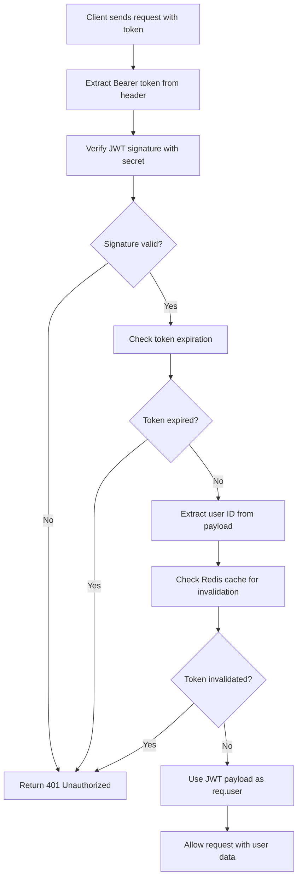

### **3. Token Refresh Process**

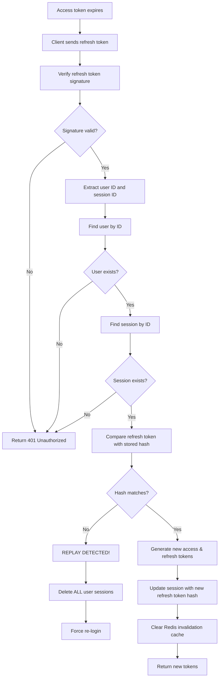

## 🔐 **Core Authentication Concepts**

### **1. JWT (JSON Web Tokens)**

JWT tokens are the foundation of the authentication mechanism:

#### **Token Structure**
```typescript
// Access Token Payload
{
  "id": "user-123",
  "walletAddress": "0x742d35Cc6634C0532925a3b8D4C9db96C4b4d8b6",
  "role": "USER",
  "iat": 1640995200,  // Issued at
  "exp": 1640995500   // Expires at (configurable)
}

// Refresh Token Payload  
{
  "id": "user-123",
  "sessionId": "session-456",
  "iat": 1640995200,
  "exp": 1641600000   // Configurable expiration
}
```

#### **Why Dual Tokens?**
- **Access Token**: Short-lived for security (configurable duration)
- **Refresh Token**: Long-lived for convenience (configurable duration)
- **Separation of Concerns**: Different security requirements

#### **Why Wallet Authentication?**
- **🔐 Cryptographic Security**: Private key signatures are mathematically unbreakable
- **🌐 Decentralized**: No central authority controls user accounts
- **🔗 Multi-Chain**: Support for Ethereum, Polygon, BSC, and other EVM chains
- **📱 User-Friendly**: Users already have wallets for DeFi and NFT interactions
- **🚫 No Password Storage**: Eliminates password-related security risks
- **⚡ Fast Authentication**: Single signature for secure login

#### **Performance Optimization: Direct JWT Payload**
```typescript
// Instead of database query on every request
// The system uses JWT payload directly as req.user
interface JwtPayload {
  id: string;
  walletAddress: string;
  role: USER_ROLE;
}

// Benefits:
// ✅ No database query on every API request
// ✅ Faster response times
// ✅ Reduced database load
// ✅ Stateless authentication
```

### **2. Session Management**

Sessions track user login state and provide security controls:

#### **Session Purpose**
- **Track Active Logins**: Know which devices are logged in
- **Device Information**: Store user agent, IP, device fingerprint
- **Token Validation**: Verify refresh tokens against stored hashes
- **Security Monitoring**: Detect suspicious login patterns

#### **Session Lifecycle**
```typescript
// Session Creation (Login)
{
  userId: "user-123",
  refreshTokenHash: "hashed-refresh-token",
  isActive: true,
  lastActive: "2024-01-01T10:00:00Z",
  deviceInfo: {
    userAgent: "Mozilla/5.0...",
    ip: "192.168.1.100",
    deviceId: "device-abc123",
    fingerprint: "browser-fingerprint"
  }
}

// Session Invalidation (Logout/Security Event)
{
  isActive: false,
  lastActive: "2024-01-01T10:30:00Z"
}
```

### **3. Wallet Authentication & Nonce Management**

The system implements secure wallet-based authentication using cryptographic signatures:

#### **Nonce Generation & Management**
```typescript
// Generate cryptographically secure nonce
const nonce = Math.random().toString(36).substring(2, 15) + 
               Math.random().toString(36).substring(2, 15);

// Store in Redis with 5-minute expiration
await this.redis.setex(
  nonceKey(walletAddress, chainType), 
  NONCE_EXPIRATION_TIME, // 300 seconds (5 minutes)
  nonce
);
```

#### **Message Signing**
```typescript
// Standard message format for signing
const message = `Login to XXX \n\nNonce: ${nonce}`;

// User signs this message with their private key
// Signature proves wallet ownership
```

#### **Signature Verification**
```typescript
// Verify signature using chain-specific verifier
const verifier = SignatureVerifierFactory.getVerifier(chainType);
const isValidSignature = await verifier.verifySignature(
  message, 
  signature, 
  walletAddress
);

if (!isValidSignature) {
  throw AuthErrors.invalidSignature();
}
```

#### **Security Benefits**
- **🔒 Replay Attack Prevention**: Each nonce can only be used once
- **⏰ Time-Limited**: Nonces expire after 5 minutes
- **🔐 Cryptographic Proof**: Signature mathematically proves wallet ownership
- **🌐 Multi-Chain Support**: Different verification logic per blockchain
- **🚫 No Password Storage**: Eliminates password-related vulnerabilities

### **4. Token Invalidation Mechanism**

The system uses Redis cache for immediate token invalidation:

#### **Why Redis Cache?**
- **Immediate Effect**: No waiting for token expiration
- **Lightweight**: Fast key-value lookups
- **Automatic Cleanup**: Keys expire with token lifetime

#### **Invalidation Scenarios**
```typescript
// When user changes password
redis.set(`access-token-payload-expired:${userId}`, 'true', 'EX', 300);

// When user role changes  
redis.set(`access-token-payload-expired:${userId}`, 'true', 'EX', 300);

// When user is deleted
redis.set(`access-token-payload-expired:${userId}`, 'true', 'EX', 300);
```

#### **Validation Process**
```typescript
// During token validation
const isExpired = await redis.get(`access-token-payload-expired:${userId}`);
if (isExpired) {
  throw new UnauthorizedException('Token invalidated');
}
```

### **4. Refresh Token Security: One-Time Use**

#### **Critical Security Feature**
Refresh tokens are **single-use only** to prevent token theft:

```typescript
// Refresh token validation process
async refresh(refreshTokenDto: RefreshTokenBodyDto) {
  // 1. Verify refresh token signature
  const decoded = this.jwtService.verify<RefreshTokenPayload>(
    refreshTokenDto.refreshToken,
    { secret: this.REFRESH_TOKEN_SECRET, ignoreExpiration: false }
  );
  
  // 2. Find session by ID
  const session = await this.sessionRepository.findOne({ 
    where: { id: decoded.sessionId, isActive: true } 
  });
  
  // 3. Validate refresh token hash (using signature part only)
  const isRefreshTokenValid = await bcrypt.compare(
    refreshTokenDto.refreshToken.split('.')[2], // signature part
    session.refreshTokenHash
  );
  
  if (!isRefreshTokenValid) {
    // 🔒 SECURITY ALERT: Refresh token replay detected!
    // Delete ALL user sessions and force re-login
    await this.sessionRepository.deactivateAllUserSessions(user.id);
    throw AuthErrors.replayRefreshToken(decoded.sessionId);
  }
  
  // 4. Generate new tokens
  const result = await this.generateTokens(user, session);
  
  // 5. Update session with NEW refresh token hash
  session.refreshTokenHash = await bcrypt.hash(
    result.refreshToken.split('.')[2], // signature part
    10
  );
  await this.sessionRepository.save(session);
}
```

#### **Security Benefits**
- **Prevents Token Replay**: Each refresh token can only be used once
- **Detects Token Theft**: If same token is used twice, it's likely stolen
- **Automatic Session Cleanup**: Compromised sessions are immediately invalidated
- **Force Re-authentication**: Users must re-login after security breach

### **5. Cryptographic Signature Security**

The system uses cryptographic signatures instead of passwords for enhanced security:

#### **Signature Verification**
```typescript
// Get chain-specific signature verifier
const verifier = SignatureVerifierFactory.getVerifier(chainType);

// Verify signature cryptographically
const isValidSignature = await verifier.verifySignature(
  message, 
  signature, 
  walletAddress
);
```

#### **Security Features**
- **🔐 Mathematical Proof**: Signatures are cryptographically unbreakable
- **🌐 Multi-Chain Support**: Different verification logic per blockchain
- **🚫 No Password Storage**: Eliminates password-related vulnerabilities
- **⚡ Fast Verification**: Cryptographic verification is extremely fast
- **🔒 Private Key Security**: Users control their own security keys

### **6. Role-Based Access Control (RBAC)**

The system implements role-based permissions:

#### **User Roles**
```typescript
enum USER_ROLE {
  ADMIN = 'ADMIN',    // Full system access
  USER = 'USER',      // Standard user access
  MODERATOR = 'MODERATOR'  // Limited admin access
}
```

#### **Permission Checking**
```typescript
// Route Protection
@UseGuards(JwtAuthGuard, RolesGuard)
@Roles(USER_ROLE.ADMIN)
async adminOnlyEndpoint() { }

// Conditional Logic
if (user.role === USER_ROLE.ADMIN) {
  // Admin-specific logic
}
```

#### **Security Benefits**
- **Principle of Least Privilege**: Users get minimum required access
- **Granular Control**: Different roles for different access levels
- **Audit Trail**: Track who accessed what resources

## 🛡️ **Security Mechanisms**

### **1. Performance Optimization: Stateless Authentication**

#### **Direct JWT Payload Usage**
```typescript
// Traditional approach (database query on every request)
async validateToken(token: string) {
  const decoded = jwt.verify(token, secret);
  const user = await userRepository.findById(decoded.id); // ❌ Database query
  return user;
}

// Our approach (no database query)
async validateToken(token: string) {
  const decoded = jwt.verify(token, secret);
  return decoded; // ✅ Direct JWT payload
}
```

#### **Benefits**
- **🚀 Faster Response Times**: No database queries on API requests
- **📉 Reduced Database Load**: Less stress on database
- **⚡ Better Scalability**: Stateless authentication
- **💰 Cost Effective**: Fewer database operations

### **2. Token Security**

#### **Access Token Security**
- **Short Lifespan**: 5 minutes prevents long-term exposure
- **Stateless**: No server-side storage required
- **Signed**: Cryptographically signed to prevent tampering
- **Immediate Invalidation**: Redis cache for instant revocation

#### **Refresh Token Security**
- **Long Lifespan**: 7 days for user convenience
- **Session-Bound**: Tied to specific login session
- **Hash Storage**: Stored as bcrypt hash, not plain text
- **Device Tracking**: Linked to specific device information
- **🔒 One-Time Use**: Each refresh token can only be used once

### **3. Attack Prevention**

#### **Common Attacks Mitigated**
- **Token Theft**: Short-lived access tokens limit exposure
- **Replay Attacks**: Timestamp validation prevents reuse
- **Refresh Token Replay**: One-time use prevents token reuse
- **Man-in-the-Middle**: HTTPS + signed tokens
- **Brute Force**: Rate limiting + bcrypt slow hashing
- **Session Hijacking**: Device fingerprinting + IP tracking

#### **Security Headers**
```typescript
// Recommended security headers
{
  'Strict-Transport-Security': 'max-age=31536000; includeSubDomains',
  'X-Content-Type-Options': 'nosniff',
  'X-Frame-Options': 'DENY',
  'X-XSS-Protection': '1; mode=block'
}
```

## 🔄 **Authentication Lifecycle**

### **1. User Registration (Automatic)**
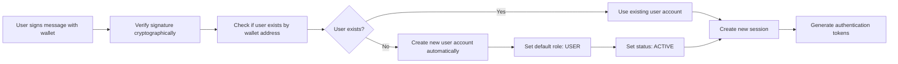

### **2. API Endpoints**

The authentication system provides the following REST endpoints:

#### **Get Nonce for Wallet Authentication**
```bash
POST /auth/get-nonce
Content-Type: application/json

{
  "walletAddress": "0x742d35Cc6634C0532925a3b8D4C9db96C4b4d8b6",
  "chainType": "ETHEREUM"
}
```

#### **Wallet Login with Signature**
```bash
POST /auth/wallet-login
Content-Type: application/json

{
  "walletAddress": "0x742d35Cc6634C0532925a3b8D4C9db96C4b4d8b6",
  "chainType": "ETHEREUM",
  "signature": "0x1234567890abcdef..."
}
```

#### **Refresh Access Token**
```bash
POST /auth/refresh
Content-Type: application/json

{
  "refreshToken": "eyJhbGciOiJIUzI1NiIsInR5cCI6IkpXVCJ9..."
}
```

### **2. User Login**
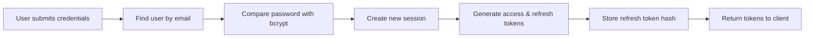

### **3. API Access**
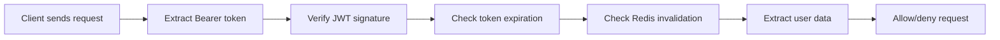

### **4. Token Refresh**
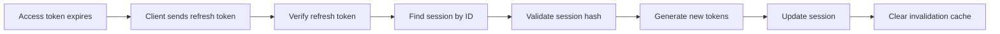

## ⚙️ **Configuration & Tuning**

### **Token Configuration**
```env
# Access Token Configuration
ACCESS_TOKEN_SECRET=your-access-token-secret-key
ACCESS_TOKEN_EXPIRATION_TIME_IN_SECONDS=300  # 5 minutes

# Refresh Token Configuration  
REFRESH_TOKEN_SECRET=your-refresh-token-secret-key
REFRESH_TOKEN_EXPIRATION_TIME_IN_SECONDS=604800  # 7 days

# JWT Configuration
JWT_SECRET=your-jwt-secret-key
JWT_EXPIRATION=300s  # 5 minutes
```

### **Security Configuration**
```env
# Nonce Expiration (5 minutes)
NONCE_EXPIRATION_TIME=300

# Redis Configuration
REDIS_HOST=localhost
REDIS_PORT=6379
REDIS_PASSWORD=your-redis-password
```

### **Why These Values?**
- **5-minute access tokens**: Balance between security and user experience
- **7-day refresh tokens**: Convenient for users, secure with session binding
- **5-minute nonce expiry**: Prevents replay attacks while allowing reasonable time for signing
- **Separate secrets**: Different secrets for access and refresh tokens enhance security

## 🚨 **Common Authentication Scenarios**

### **1. Token Expiration**
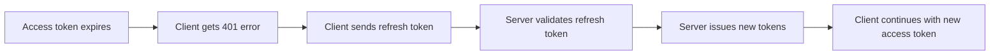

### **2. Invalid Token**
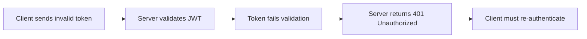

### **3. Token Invalidation**
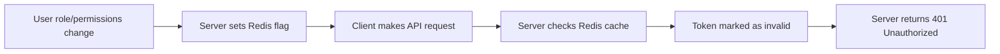

### **4. Supported Blockchain Networks**

The system supports multiple blockchain networks for wallet authentication:

```typescript
enum CHAIN_TYPE {
  ETHEREUM = 'ETHEREUM',      // Ethereum Mainnet
  POLYGON = 'POLYGON',        // Polygon Network
  BSC = 'BSC',                // Binance Smart Chain
  ARBITRUM = 'ARBITRUM',      // Arbitrum One
  OPTIMISM = 'OPTIMISM',      // Optimism Network
  SEPOLIA = 'SEPOLIA',        // Ethereum Sepolia Testnet
  BSC_TESTNET = 'BSC_TESTNET', // BSC Testnet
  POLYGON_MUMBAI = 'POLYGON_MUMBAI' // Polygon Mumbai Testnet
}
```

#### **Chain-Specific Signature Verification**
```typescript
// Factory pattern for chain-specific verifiers
const verifier = SignatureVerifierFactory.getVerifier(chainType);

// Each chain may have different signature verification logic
// - Ethereum: EIP-191 personal_sign
// - Polygon: Same as Ethereum
// - BSC: Same as Ethereum
// - Custom chains: Extensible verification logic
```

### **4. Refresh Token Replay Detection**
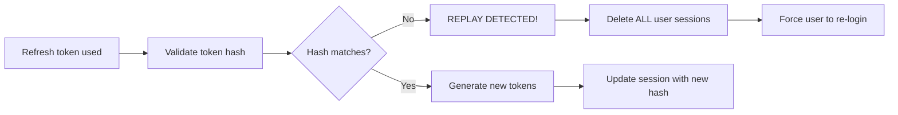

### **5. Session Compromise**
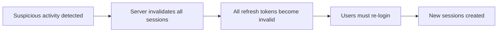

## 🔍 **Troubleshooting Authentication Issues**

### **Common Problems & Solutions**

#### **1. "Token Expired" Errors**
- **Cause**: Access token has expired (configurable duration)
- **Solution**: Use refresh token to get new access token
- **Prevention**: Implement automatic token refresh

#### **2. "Invalid Token" Errors**
- **Cause**: Token signature invalid or tampered
- **Solution**: User must re-login
- **Prevention**: Secure token storage, HTTPS only

#### **3. "Token Invalidated" Errors**
- **Cause**: User role/permissions changed or user deleted
- **Solution**: User must re-login
- **Prevention**: Inform users about token invalidation

#### **4. "Session Not Found" Errors**
- **Cause**: Refresh token doesn't match stored session
- **Solution**: User must re-login
- **Prevention**: Secure session management

#### **5. "Refresh Token Replay Detected" Errors**
- **Cause**: Same refresh token used multiple times (potential theft)
- **Solution**: All sessions deleted, user must re-login
- **Prevention**: One-time use refresh tokens, secure token storage

#### **6. "Invalid Nonce" Errors**
- **Cause**: Nonce expired or already used
- **Solution**: Request new nonce and retry
- **Prevention**: Use nonce within 5 minutes, don't reuse

#### **7. "Invalid Signature" Errors**
- **Cause**: Signature verification failed
- **Solution**: Ensure correct message format and wallet address
- **Prevention**: Use proper signing libraries, verify chain type

### **Debugging Steps**
1. **Check token expiration**: Verify `exp` claim in JWT
2. **Verify token signature**: Ensure secret keys match
3. **Check Redis cache**: Look for invalidation flags
4. **Validate session**: Confirm session exists and is active
5. **Check device info**: Verify device fingerprint matches
6. **Check refresh token hash**: Verify token hasn't been used before
7. **Monitor session logs**: Look for replay detection events
8. **Verify nonce validity**: Check Redis for nonce existence and expiration
9. **Validate signature**: Ensure correct message format and chain type
10. **Check wallet address**: Verify address format and checksum

## 🎯 **Best Practices for Authentication**

### **1. Client-Side Wallet Integration**
- **Use Web3 libraries**: ethers.js, web3.js, or similar
- **Implement proper signing**: Use `personal_sign` for message signing
- **Handle multiple chains**: Support different blockchain networks
- **Error handling**: Graceful fallback for unsupported chains

### **2. Client-Side Token Management**
- **Store access tokens in memory** (not localStorage)
- **Use httpOnly cookies** for refresh tokens
- **Implement automatic token refresh** before expiration
- **Handle 401 errors gracefully** with re-authentication

### **2. Security Considerations**
- **Always use HTTPS** in production
- **Implement rate limiting** on auth endpoints
- **Log authentication events** for monitoring
- **Use secure session management**

### **3. User Experience**
- **Provide clear error messages** for auth failures
- **Implement progressive enhancement** for token refresh
- **Consider offline scenarios** and token caching
- **Offer "Remember Me" functionality** with longer refresh tokens

### **4. Monitoring & Alerting**
- **Track failed login attempts** for security monitoring
- **Monitor token refresh patterns** for anomalies
- **Alert on suspicious activity** (multiple failed logins, unusual locations)
- **Log session creation/deletion** for audit trails

## 💻 **Practical Examples**

### **Client-Side Wallet Authentication (JavaScript/TypeScript)**

#### **Using ethers.js**
```typescript
import { ethers } from 'ethers';

class WalletAuthClient {
  private provider: ethers.BrowserProvider;
  private signer: ethers.JsonRpcSigner;

  async connectWallet() {
    // Request wallet connection
    this.provider = new ethers.BrowserProvider(window.ethereum);
    this.signer = await this.provider.getSigner();
    return await this.signer.getAddress();
  }

  async authenticate(walletAddress: string, chainType: string) {
    try {
      // Step 1: Get nonce from server
      const nonceResponse = await fetch('/auth/get-nonce', {
        method: 'POST',
        headers: { 'Content-Type': 'application/json' },
        body: JSON.stringify({ walletAddress, chainType })
      });
      
      const { nonce, message } = await nonceResponse.json();
      
      // Step 2: Sign message with wallet
      const signature = await this.signer.signMessage(message);
      
      // Step 3: Send signature to server
      const loginResponse = await fetch('/auth/wallet-login', {
        method: 'POST',
        headers: { 'Content-Type': 'application/json' },
        body: JSON.stringify({
          walletAddress,
          chainType,
          signature
        })
      });
      
      const { accessToken, refreshToken, profile } = await loginResponse.json();
      
      // Store tokens securely
      this.storeTokens(accessToken, refreshToken);
      
      return { profile, accessToken, refreshToken };
    } catch (error) {
      console.error('Authentication failed:', error);
      throw error;
    }
  }

  private storeTokens(accessToken: string, refreshToken: string) {
    // Store access token in memory (sessionStorage for SPA)
    sessionStorage.setItem('accessToken', accessToken);
    
    // Store refresh token in httpOnly cookie (set by server)
    // Or use secure storage method
  }
}
```

#### **Using web3.js**
```typescript
import Web3 from 'web3';

class Web3AuthClient {
  private web3: Web3;
  private account: string;

  async connectWallet() {
    if (typeof window.ethereum !== 'undefined') {
      this.web3 = new Web3(window.ethereum);
      const accounts = await window.ethereum.request({ 
        method: 'eth_requestAccounts' 
      });
      this.account = accounts[0];
      return this.account;
    } else {
      throw new Error('MetaMask not installed');
    }
  }

  async signMessage(message: string) {
    const signature = await this.web3.eth.personal.sign(
      message,
      this.account,
      '' // password (not needed for MetaMask)
    );
    return signature;
  }
}
```

### **Error Handling Examples**
```typescript
// Handle authentication errors gracefully
try {
  const result = await walletAuth.authenticate(walletAddress, 'ETHEREUM');
  // Handle successful authentication
} catch (error) {
  if (error.message.includes('Invalid nonce')) {
    // Nonce expired, request new one
    await this.refreshNonce();
  } else if (error.message.includes('Invalid signature')) {
    // Signature verification failed
    this.showError('Invalid signature. Please try again.');
  } else if (error.message.includes('User rejected')) {
    // User rejected the signature request
    this.showError('Please approve the signature request to continue.');
  } else {
    // Generic error handling
    this.showError('Authentication failed. Please try again.');
  }
}
```

## 📚 **Further Reading**

### **Related Documentation**
- **[Module Structure Guide](MODULE_STRUCTURE_GUIDE.md)** - Understanding module organization
- **[Development Guide](DEVELOPMENT.md)** - Setting up and working with the codebase
- **[Convention Guide](CONVENTION.md)** - Coding standards and patterns

### **External Resources**
- **[JWT.io](https://jwt.io/)** - JWT token debugger and documentation
- **[OWASP Authentication](https://owasp.org/www-project-web-security-testing-guide/latest/4-Web_Application_Security_Testing/04-Authentication_Testing/)** - Security testing guidelines
- **[Ethers.js Documentation](https://docs.ethers.org/)** - Ethereum library for wallet integration
- **[Web3.js Documentation](https://web3js.org/)** - Ethereum JavaScript API
- **[EIP-191](https://eips.ethereum.org/EIPS/eip-191)** - Ethereum personal message signing standard

## 🔒 **Advanced Security Mechanisms (Optional)**

For applications requiring **maximum security**, consider implementing these additional mechanisms:

### **1. Device Fingerprinting**

#### **Enhanced Device Tracking**
```typescript
interface DeviceFingerprint {
  userAgent: string;
  screenResolution: string;
  timezone: string;
  language: string;
  platform: string;
  hardwareConcurrency: number;
  deviceMemory: number;
  canvasFingerprint: string;
  webglFingerprint: string;
  audioFingerprint: string;
}
```

#### **Implementation Benefits**
- **Unique Device Identification**: Each device gets a unique fingerprint
- **Suspicious Activity Detection**: Detect logins from unknown devices
- **Session Validation**: Verify device matches original login
- **Geolocation Tracking**: Monitor login locations

### **2. New Device Detection**

#### **Automatic Detection System**
```typescript
// During login process
async detectNewDevice(userId: string, deviceFingerprint: DeviceFingerprint) {
  const existingDevices = await this.sessionRepository.findUserDevices(userId);
  const isNewDevice = !existingDevices.some(device => 
    this.compareFingerprints(device.fingerprint, deviceFingerprint)
  );
  
  if (isNewDevice) {
    // Send email/SMS notification
    await this.notificationService.sendNewDeviceAlert(userId, deviceFingerprint);
    
    // Require additional verification
    return { requiresVerification: true, verificationType: 'email' };
  }
  
  return { requiresVerification: false };
}
```

#### **Security Features**
- **Email/SMS Alerts**: Notify user of new device login
- **Additional Verification**: Require 2FA for new devices
- **Device Approval**: Allow users to approve/deny new devices
- **Suspicious Location Detection**: Alert on unusual login locations

### **3. Device Limit Management**

#### **Configurable Device Limits**
```typescript
interface DeviceLimitConfig {
  maxDevicesPerUser: number;        // e.g., 5 devices
  maxConcurrentSessions: number;    // e.g., 3 active sessions
  sessionTimeoutMinutes: number;    // e.g., 30 minutes inactive
  forceLogoutOnLimit: boolean;      // Force logout oldest session
}
```

#### **Implementation Examples**
```typescript
// Check device limits before login
async checkDeviceLimits(userId: string) {
  const activeSessions = await this.sessionRepository.countActiveSessions(userId);
  
  if (activeSessions >= this.config.maxDevicesPerUser) {
    if (this.config.forceLogoutOnLimit) {
      // Logout oldest session
      await this.sessionRepository.logoutOldestSession(userId);
    } else {
      throw new Error('Maximum devices reached');
    }
  }
}

// Session timeout management
async checkSessionTimeout(sessionId: string) {
  const session = await this.sessionRepository.findById(sessionId);
  const inactiveTime = Date.now() - session.lastActive.getTime();
  
  if (inactiveTime > this.config.sessionTimeoutMinutes * 60 * 1000) {
    await this.sessionRepository.deactivateSession(sessionId);
    throw new Error('Session expired due to inactivity');
  }
}
```

### **4. Enhanced Session Security**

#### **Session Monitoring**
```typescript
interface SessionSecurity {
  ipWhitelist: string[];           // Allowed IP addresses
  geolocationRestrictions: string[]; // Allowed countries
  timeRestrictions: {              // Allowed login hours
    startHour: number;
    endHour: number;
    timezone: string;
  };
  suspiciousActivityThreshold: number; // Failed attempts before lockout
}
```

#### **Real-time Security Checks**
```typescript
// During API requests
async validateSessionSecurity(sessionId: string, requestIp: string) {
  const session = await this.sessionRepository.findById(sessionId);
  
  // IP validation
  if (session.security.ipWhitelist.length > 0) {
    if (!session.security.ipWhitelist.includes(requestIp)) {
      await this.securityService.logSuspiciousActivity(sessionId, 'IP_MISMATCH');
      throw new Error('Access denied from this IP');
    }
  }
  
  // Geolocation check
  const location = await this.geolocationService.getLocation(requestIp);
  if (!session.security.geolocationRestrictions.includes(location.country)) {
    await this.securityService.logSuspiciousActivity(sessionId, 'LOCATION_MISMATCH');
    throw new Error('Access denied from this location');
  }
  
  // Time restriction check
  const currentTime = new Date();
  if (!this.isWithinTimeRestrictions(currentTime, session.security.timeRestrictions)) {
    await this.securityService.logSuspiciousActivity(sessionId, 'TIME_RESTRICTION');
    throw new Error('Access denied at this time');
  }
}
```

### **5. Multi-Factor Authentication (MFA)**

#### **MFA Implementation**
```typescript
interface MFAConfig {
  enabled: boolean;
  methods: ('email' | 'sms' | 'totp' | 'webauthn')[];
  requiredForNewDevices: boolean;
  requiredForSensitiveOperations: boolean;
}

// MFA verification flow
async verifyMFA(userId: string, method: string, code: string) {
  const mfaSession = await this.mfaRepository.findActiveSession(userId);
  
  if (!mfaSession || mfaSession.expiresAt < new Date()) {
    throw new Error('MFA session expired');
  }
  
  const isValid = await this.mfaService.verifyCode(method, code, mfaSession);
  
  if (isValid) {
    await this.mfaRepository.completeSession(mfaSession.id);
    return { verified: true };
  } else {
    await this.securityService.logFailedMFA(userId, method);
    throw new Error('Invalid MFA code');
  }
}
```

### **6. Security Monitoring & Alerting**

#### **Real-time Security Dashboard**
```typescript
interface SecurityMetrics {
  failedLoginAttempts: number;
  suspiciousActivities: number;
  newDeviceLogins: number;
  sessionTimeouts: number;
  mfaFailures: number;
  geolocationViolations: number;
}

// Security monitoring
async monitorSecurityActivity() {
  const metrics = await this.securityService.getMetrics();
  
  // Alert on suspicious patterns
  if (metrics.failedLoginAttempts > 10) {
    await this.alertService.sendSecurityAlert('HIGH_FAILED_LOGINS');
  }
  
  if (metrics.suspiciousActivities > 5) {
    await this.alertService.sendSecurityAlert('SUSPICIOUS_ACTIVITY_SPIKE');
  }
  
  // Generate security reports
  await this.reportService.generateSecurityReport(metrics);
}
```

### **7. Implementation Considerations**

#### **Performance Impact**
- **Device Fingerprinting**: Adds ~100-200ms to login process
- **Geolocation Checks**: Requires external API calls
- **Session Monitoring**: Adds overhead to API requests
- **MFA Verification**: Additional step in authentication flow

#### **User Experience**
- **Progressive Enhancement**: Start with basic security, add features gradually
- **User Education**: Explain security features to users
- **Graceful Degradation**: Handle security failures gracefully
- **Clear Communication**: Inform users about security measures

#### **Configuration Options**
```typescript
interface SecurityConfig {
  // Basic security (current implementation)
  basic: {
    jwtExpiration: number;
    refreshTokenExpiration: number;
    bcryptRounds: number;
  };
  
  // Enhanced security (optional)
  enhanced: {
    deviceFingerprinting: boolean;
    newDeviceDetection: boolean;
    deviceLimits: boolean;
    geolocationRestrictions: boolean;
    mfa: boolean;
    sessionMonitoring: boolean;
  };
}
```

---

**These advanced security mechanisms provide enterprise-grade protection for applications requiring maximum security. Implement them based on your specific security requirements and user experience needs.**

---

**This authentication mechanism provides enterprise-grade security with comprehensive session management, role-based access control, and robust error handling. Understanding these concepts is essential for building secure applications and troubleshooting authentication issues.** 