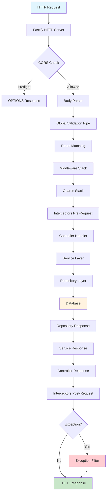
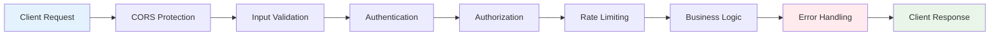
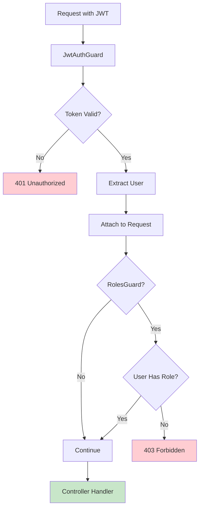
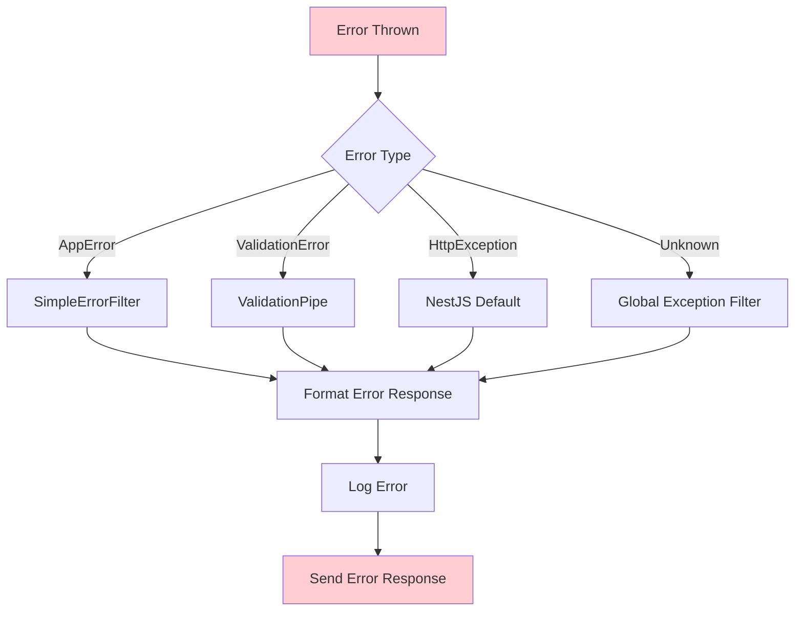
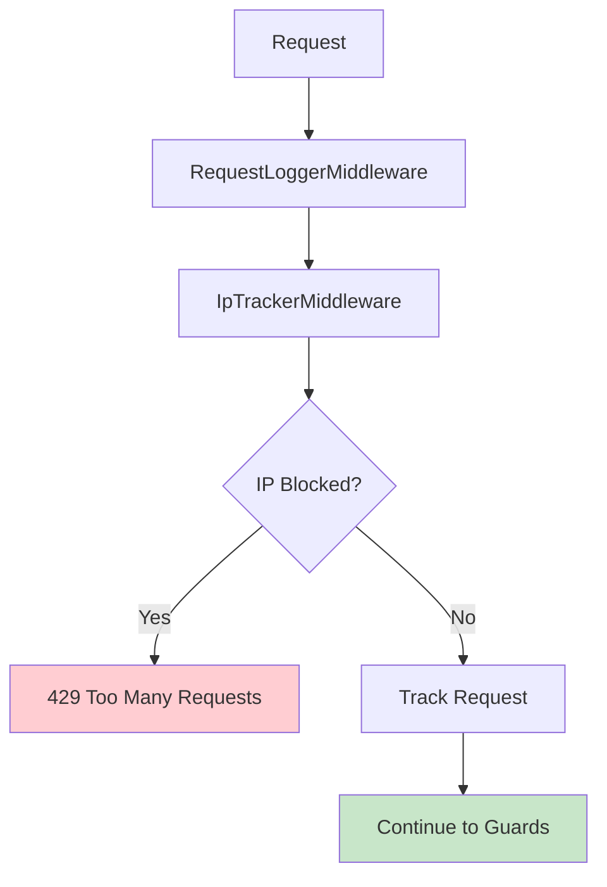
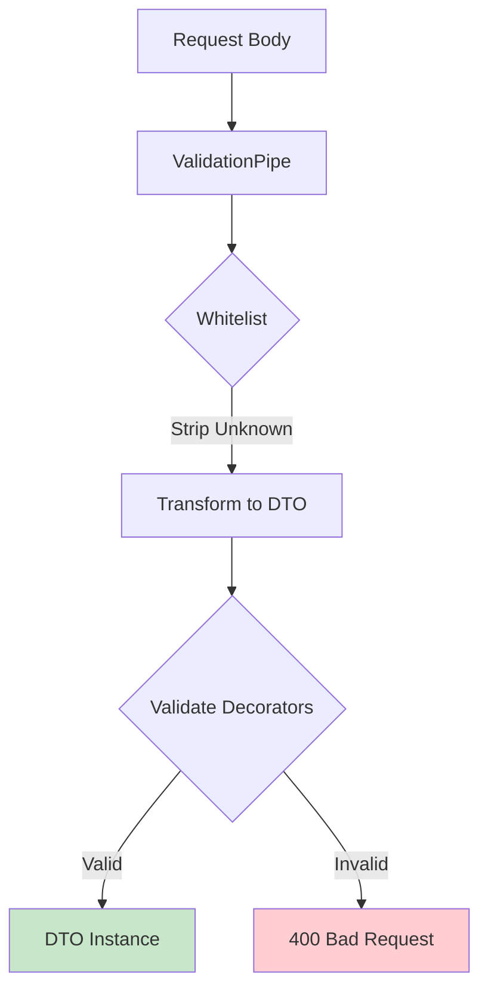
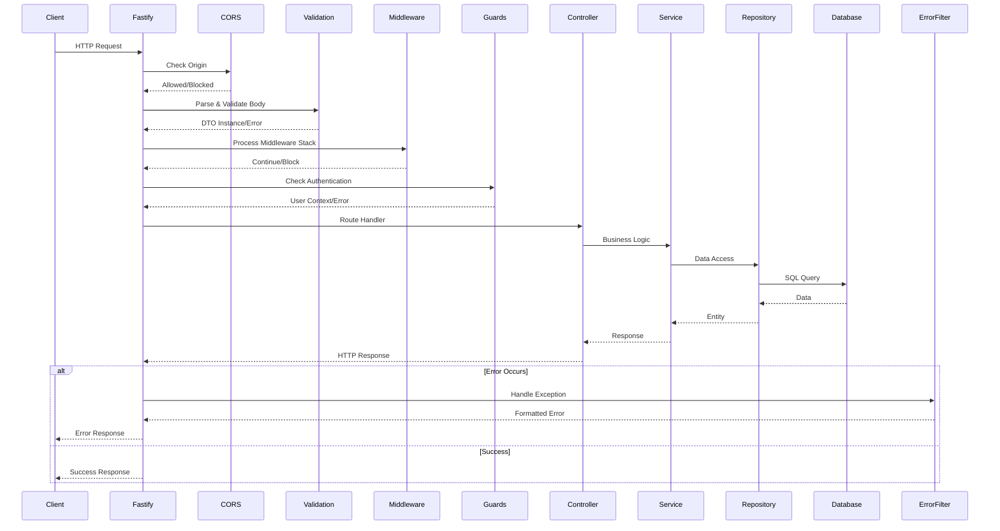
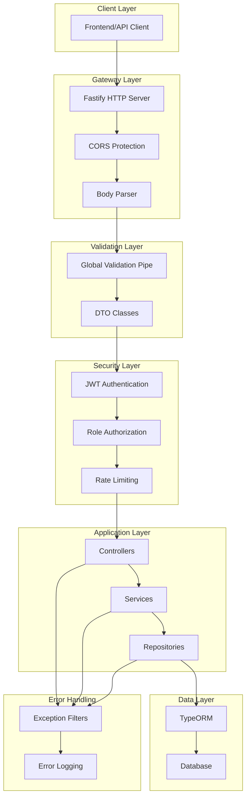

# Request Lifecycle Guide

## 🎯 **Overview**

This guide explains the complete request lifecycle in the NestJS Backend Boilerplate, from incoming HTTP request to response. Understanding this flow helps new developers quickly grasp how the application processes requests.

## 📊 **Request Lifecycle Diagrams**

### **1. Main Request Flow**



### **2. Security Layers Flow**



### **3. Authentication & Authorization Flow**



### **4. Error Handling Flow**



### **5. Middleware Stack**



### **6. Validation Flow**



### **7. Complete Request Sequence**



### **8. Module Architecture**


## 🔧 **Detailed Flow Breakdown**

### **1. Application Bootstrap** (`main.ts`)

```typescript
// 1. Create NestJS application with Fastify
const app = await NestFactory.create<NestFastifyApplication>(
  AppModule,
  new FastifyAdapter(),
);

// 2. Configure global pipes (validation)
app.useGlobalPipes(
  new ValidationPipe({
    whitelist: true,    // Strip unknown properties
    transform: true,    // Transform payloads to DTOs
  }),
);

// 3. Configure global exception filter
app.useGlobalFilters(new SimpleErrorFilter());

// 4. Configure CORS
configCors(app);

// 5. Configure Swagger documentation
configSwagger(app);
```

### **2. CORS Configuration** (`cors.config.ts`)

```typescript
export function configCors(app: INestApplication) {
  app.enableCors({
    origin: whiteList,                    // Allowed origins
    methods: ['GET', 'POST', 'PUT', 'DELETE', 'PATCH', 'OPTIONS'],
    credentials: true,                    // Allow cookies/auth headers
  });
}
```

**Purpose**: Handles cross-origin requests and preflight OPTIONS requests.

### **3. Body Parsing** (Fastify Built-in)

- **JSON**: Automatically parses `application/json` requests
- **Form Data**: Handles `application/x-www-form-urlencoded` and `multipart/form-data`
- **Raw**: Processes raw body data

### **4. Global Validation Pipe** (`main.ts`)

```typescript
new ValidationPipe({
  whitelist: true,    // Remove properties not in DTO
  transform: true,    // Transform payload to DTO instance
})
```

**Validation Flow**:
1. **Whitelist**: Strips unknown properties from request body
2. **Transform**: Converts request body to DTO class instance
3. **Validate**: Checks all validation decorators (`@IsEmail()`, `@MinLength()`, etc.)

**Example DTO**:
```typescript
export class LoginBodyDto {
  @ApiProperty({ description: 'User email address' })
  @IsEmail()
  email: string;

  @ApiProperty({ description: 'User password' })
  @IsString()
  @MinLength(8)
  @MaxLength(128)
  password: string;
}
```

### **5. Route Matching** (NestJS Router)

- Matches HTTP method and URL path to controller route
- Extracts route parameters, query parameters, and request body
- Maps to specific controller method

### **6. Middleware Execution**

#### **Request Logger Middleware** (`logger.middleware.ts`)
```typescript
@Injectable()
export class RequestLoggerMiddleware implements NestMiddleware {
  use(req: Request, res: Response, next: NextFunction) {
    const start = Date.now();
    
    res.on('finish', () => {
      const duration = Date.now() - start;
      this.logger.log(`${method} ${originalUrl} ${statusCode} ${duration}ms ${ip}`);
    });
    
    next();
  }
}
```

#### **IP Tracker Middleware** (`ip-tracker.middleware.ts`)
```typescript
@Injectable()
export class IpTrackerMiddleware implements NestMiddleware {
  async use(req: Request, res: Response, next: NextFunction) {
    const ip = req.headers['x-real-ip'] || req.socket.remoteAddress;
    
    const isBlocked = await this.ipTrackerService.isIpBlocked(ip);
    if (isBlocked) {
      throw new HttpException('Too many requests', HttpStatus.TOO_MANY_REQUESTS);
    }
    
    await this.ipTrackerService.trackRequest(ip, req.path);
    next();
  }
}
```

### **7. Guards Execution**

#### **JWT Authentication Guard** (`jwt-auth.guard.ts`)
```typescript
@Injectable()
export class JwtAuthGuard extends AuthGuard('jwt') {
  getRequest(context: ExecutionContext): FastifyRequest {
    return context.switchToHttp().getRequest();
  }
}
```

**Authentication Flow**:
1. Extracts JWT token from `Authorization: Bearer <token>` header
2. Validates token using JWT strategy
3. Decodes payload and attaches user to request object
4. Throws `UnauthorizedException` if token is invalid/missing

#### **JWT Strategy** (`jwt.strategy.ts`)
```typescript
@Injectable()
export class JwtStrategy extends PassportStrategy(Strategy) {
  constructor(private configService: ConfigService<EnvConfig>) {
    super({
      jwtFromRequest: ExtractJwt.fromAuthHeaderAsBearerToken(),
      ignoreExpiration: false,
      secretOrKey: String(configService.get<string>('JWT_SECRET')),
    });
  }

  validate(payload: JwtPayload) {
    return payload; // Attached to request.user
  }
}
```

#### **Roles Guard** (`roles.guard.ts`)
```typescript
@Injectable()
export class RolesGuard implements CanActivate {
  canActivate(context: ExecutionContext): boolean {
    const requiredRoles = this.reflector.getAllAndOverride<USER_ROLE[]>(
      ROLES_KEY,
      [context.getHandler(), context.getClass()],
    );

    if (!requiredRoles) return true;

    const request = context.switchToHttp().getRequest<RequestWithUser>();
    const user = request.user;

    if (!user) {
      throw new ForbiddenException('User not authenticated');
    }

    const hasRole = requiredRoles.some((role) => user.role === role);
    
    if (!hasRole) {
      throw new ForbiddenException(`Access denied. Required roles: ${requiredRoles.join(', ')}`);
    }

    return true;
  }
}
```

**Usage in Controller**:
```typescript
@Post()
@UseGuards(JwtAuthGuard, RolesGuard)
@Roles(USER_ROLE.ADMIN)
async createUser(@Body() createUserDto: CreateUserBodyDto) {
  return this.usersService.createUser(createUserDto);
}
```

### **8. Controller Execution**

#### **Parameter Extraction**
```typescript
@Post('login')
async login(
  @Body() loginDto: LoginBodyDto,        // Request body (validated)
  @Req() req: Request,                   // Full request object
  @Query() query: any,                   // Query parameters
  @Param() params: any,                  // Route parameters
) {
  return this.authService.login(loginDto);
}
```

#### **DTO Validation**
- Request body is automatically validated against DTO class
- Invalid data throws `BadRequestException`
- Valid data is transformed to DTO instance

### **9. Service Layer** (Business Logic)

```typescript
@Injectable()
export class AuthService extends AbstractService<UserEntity> {
  async login(loginDto: LoginBodyDto) {
    // 1. Business logic validation
    const user = await this.userRepository.findByEmail(loginDto.email);
    if (!user) {
      throw AuthErrors.userNotFound(loginDto.email);
    }

    // 2. Password verification
    const isPasswordValid = await bcrypt.compare(loginDto.password, user.password);
    if (!isPasswordValid) {
      throw AuthErrors.invalidCredentials();
    }

    // 3. Token generation
    const payload = { sub: user.id, email: user.email, role: user.role };
    const accessToken = this.jwtService.sign(payload);
    const refreshToken = this.jwtService.sign(payload, { expiresIn: '7d' });

    // 4. Session management
    await this.sessionRepository.save({
      userId: user.id,
      refreshTokenHash: await bcrypt.hash(refreshToken, 10),
      isActive: true,
      lastActive: new Date(),
    });

    // 5. Return response
    return {
      accessToken,
      refreshToken,
      tokenType: 'Bearer',
      expiresIn: 3600,
      user: { id: user.id, email: user.email, name: user.name, role: user.role },
    };
  }
}
```

### **10. Repository Layer** (Data Access)

```typescript
@Injectable()
export class UserRepository extends AbstractRepository<UserEntity> {
  async findByEmail(email: string): Promise<UserEntity | null> {
    return this.findOne({ where: { email } });
  }

  async findByUsername(username: string): Promise<UserEntity | null> {
    return this.findOne({ where: { username } });
  }

  async create(userData: Partial<UserEntity>): Promise<UserEntity> {
    const user = this.create(userData);
    return this.save(user);
  }
}
```

### **11. Database Operations**

- **TypeORM**: Handles database connections, queries, and transactions
- **Entity Mapping**: Converts database rows to TypeScript objects
- **Query Building**: Constructs optimized SQL queries
- **Transaction Management**: Ensures data consistency

### **12. Exception Handling** (`simple-error.filter.ts`)

```typescript
@Catch(AppError)
export class SimpleErrorFilter implements ExceptionFilter {
  private readonly logger = new Logger(SimpleErrorFilter.name);

  catch(exception: AppError<any>, host: ArgumentsHost) {
    const ctx = host.switchToHttp();
    const response = ctx.getResponse<Response>();
    const request = ctx.getRequest<Request>();

    // Log error with context
    this.logger.error(
      `[${exception.statusCode}] ${exception.errorCode} - ${exception.message} | ${request.method} ${request.url}`,
      exception.stack,
    );

    // Format error response
    const errorResponse = {
      success: false,
      error: {
        code: exception.errorCode,
        message: exception.message,
        statusCode: exception.statusCode,
        path: request.url,
        timestamp: new Date().toISOString(),
      },
    };

    response.status(exception.statusCode).json(errorResponse);
  }
}
```

**Error Response Format**:
```json
{
  "success": false,
  "error": {
    "code": "AUTH_INVALID_CREDENTIALS",
    "message": "Invalid email or password",
    "statusCode": 401,
    "path": "/auth/login",
    "timestamp": "2024-01-01T00:00:00.000Z"
  }
}
```

## 🔄 **Complete Example Flow**

### **Request**: `POST /auth/login`
```json
{
  "email": "john@example.com",
  "password": "password123"
}
```

### **Flow**:
1. **Fastify** receives HTTP request
2. **CORS** checks origin (if needed)
3. **Body Parser** extracts JSON body
4. **ValidationPipe** validates against `LoginBodyDto`
5. **Route Matching** finds `AuthController.login()`
6. **RequestLogger** logs request start
7. **IpTracker** checks rate limiting
8. **JwtAuthGuard** (skipped - no auth required for login)
9. **Controller** extracts `loginDto` from body
10. **AuthService.login()** executes business logic
11. **UserRepository.findByEmail()** queries database
12. **Database** returns user data
13. **Service** validates password, generates tokens
14. **SessionRepository.save()** stores session
15. **Controller** returns response
16. **RequestLogger** logs completion
17. **Fastify** sends HTTP response

### **Response**:
```json
{
  "accessToken": "eyJhbGciOiJIUzI1NiIsInR5cCI6IkpXVCJ9...",
  "refreshToken": "eyJhbGciOiJIUzI1NiIsInR5cCI6IkpXVCJ9...",
  "tokenType": "Bearer",
  "expiresIn": 3600,
  "user": {
    "id": "123e4567-e89b-12d3-a456-426614174000",
    "email": "john@example.com",
    "name": "John Doe",
    "role": "USER"
  }
}
```

## 🛡️ **Security Layers**

### **1. CORS Protection**
- Prevents unauthorized cross-origin requests
- Configurable allowed origins

### **2. Input Validation**
- DTO validation prevents malicious input
- Whitelist removes unknown properties
- Type transformation ensures data integrity

### **3. Authentication**
- JWT token validation
- Session management
- Token expiration handling

### **4. Authorization**
- Role-based access control
- Route-level permissions
- User context validation

### **5. Rate Limiting**
- IP-based request tracking
- Automatic blocking of abusive IPs
- Configurable limits

### **6. Error Handling**
- Structured error responses
- No sensitive data leakage
- Comprehensive logging

## 📝 **Key Takeaways**

1. **Layered Architecture**: Each layer has a specific responsibility
2. **Security First**: Multiple security layers protect the application
3. **Validation**: Input validation happens at multiple levels
4. **Error Handling**: Centralized error handling with detailed logging
5. **Performance**: Middleware and guards are optimized for speed
6. **Maintainability**: Clear separation of concerns makes code easy to maintain

## 🚀 **Quick Reference**

| Component | Purpose | Location |
|-----------|---------|----------|
| **CORS** | Cross-origin protection | `cors.config.ts` |
| **Validation** | Input validation | `main.ts` (ValidationPipe) |
| **Authentication** | JWT token validation | `jwt-auth.guard.ts` |
| **Authorization** | Role-based access | `roles.guard.ts` |
| **Logging** | Request/response logging | `logger.middleware.ts` |
| **Rate Limiting** | IP-based protection | `ip-tracker.middleware.ts` |
| **Error Handling** | Global error formatting | `simple-error.filter.ts` |
| **Documentation** | API documentation | `api-doc.config.ts` | 